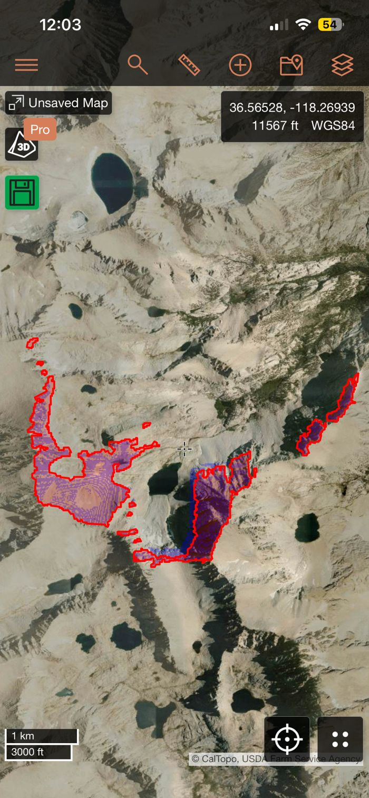
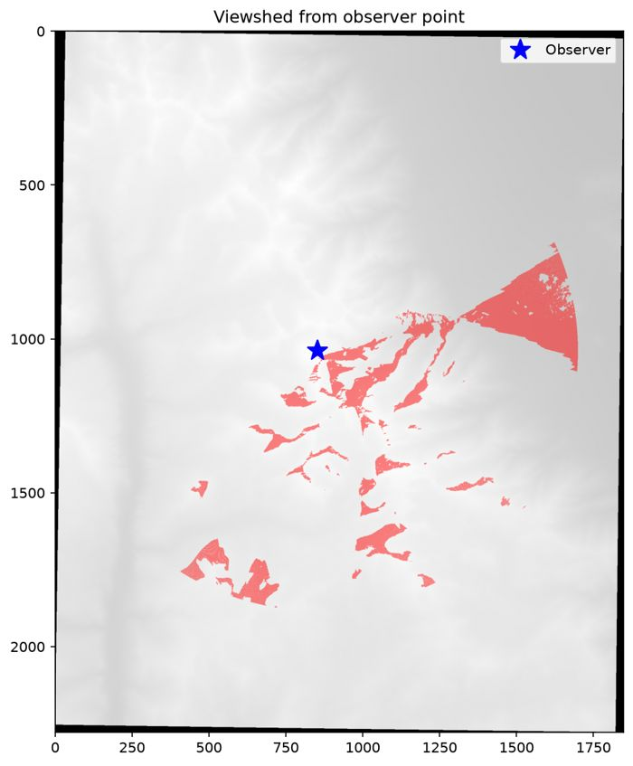
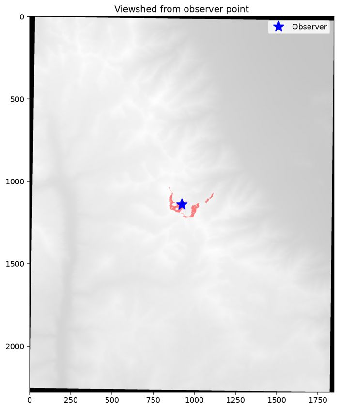
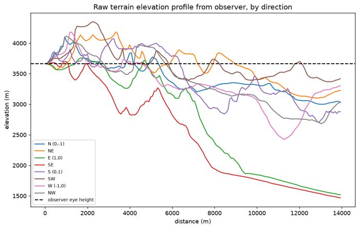

# CalTopo Viewshed

[CalTopo](https://caltopo.com) already has a built-in viewshed layer — this project isn't trying to replace it. I wanted to understand how one actually works, so I rebuilt it myself, starting from a from-scratch visibility algorithm validated against CalTopo's own tool. It's grown since then into a small web app: upload a hiking route, and it shows you exactly what terrain — and which named peaks and lakes — you can see from every point along it.

A **viewshed** is the set of terrain visible from a given point, accounting for the ground blocking your view of anything behind it.

## Validation

The real test: does this independently-written algorithm agree with CalTopo's own built-in tool for the same point? I generated a viewshed with this code, imported it into CalTopo as an overlay (red outline), then turned on CalTopo's native viewshed for the same observer point (blue fill) on top of it.



The two agree almost exactly.

## How the algorithm works

1. **Elevation data** — a DEM patch is pulled from the [USGS 3DEP dynamic elevation service](https://elevation.nationalmap.gov/arcgis/rest/services/3DEPElevation/ImageServer), then reprojected into a local UTM zone so distances are true meters rather than degrees.
2. **Visibility** — a **rotational horizon sweep**: cast rays outward from the observer in every direction, walking each ray in one-pixel steps. Along each ray, track the steepest elevation angle seen so far; a point is visible only if it exceeds every angle seen closer in on that same ray. This turns viewshed computation from an expensive per-cell ray-cast into a single pass per direction — see [`viewshed.py`](viewshed.py) for the full implementation. Every ray is independent, so they're dispatched across a `multiprocessing.Pool` rather than a plain loop — a ~2.7x speedup on an 8-core machine, with the per-ray algorithm itself completely unchanged.
3. **Earth curvature + atmospheric refraction** — folded into one effective-Earth-radius correction, subtracted from a target's apparent height before computing its angle. Matters more than you'd expect at the several-kilometer scale mountain viewsheds operate at.
4. **Output** — the boolean visibility grid is polygonized, simplified, and reprojected back to lon/lat as GeoJSON, importable directly into CalTopo as a map overlay.

## Web app

[`webapp/`](webapp/) is the primary way to use this now: upload a GPX route, and DEM fetching, UTM zone detection, reprojection, and viewshed computation all happen automatically, one small DEM tile per sample point along the route (so route length never causes a failure — a 4-mile route and a 40-mile route both just work, with proportionally more sample points).

```
source .venv/bin/activate
python3 webapp/app.py
```

This opens `http://127.0.0.1:5000` automatically. The dashboard lists routes you've already computed; "Upload new route" takes you to the form (eye height defaults to a generous 10m to allow for GPS/coordinate imprecision, step distance defaults to 0.5mi, and you can label the route). Computation takes roughly 10-15s per sample point (fetch + compute) — each finished route is saved so you can revisit or delete it later.

**[Try a live example](https://jacobburrill11.github.io/caltopo-viewshed/route_viewshed_viewer.html)** — a real ~1.5 mile trail near Lake Tahoe ([`examples/cinder_cone_trail.gpx`](examples/cinder_cone_trail.gpx)). Drag the slider and watch the visible area change as the position moves along the route, similar to CalTopo's own elevation-profile scrubber.

**Named peaks and lakes**: every sample's viewshed also gets checked against nearby named terrain — peaks from [USGS GNIS](https://www.usgs.gov/us-board-on-geographic-names), lakes from OpenStreetMap (GNIS's own lake data turned out to be missing major lakes entirely, e.g. Lake Tahoe — verified during testing, not assumed). Labeled markers on the map update as you drag the scrubber; a collapsible panel lists every named feature visible from anywhere along the whole route, capped to the tallest peaks so a wide-open view doesn't turn into a list of hundreds.

This is still an early-stage app: single-user, no accounts, synchronous request/response (a "please wait" message, no progress bar). GIF export is the next planned addition.

## Using the CLI directly

The web app is a thin Flask layer over [`route_animation.py`](route_animation.py), which works standalone:

```
python3 route_animation.py export --gpx route.gpx --out route_viewsheds.geojson
```

Same automatic per-sample DEM fetching as the web app (UTM zone auto-detected; override with `--utm-crs` only to force a zone), writing one GeoJSON `FeatureCollection` you can open in [`route_viewshed_viewer.html`](route_viewshed_viewer.html) (needs a local server for its `fetch()` call, e.g. `python3 -m http.server`) or import any individual sample's polygon straight into CalTopo. `--eye-height` and `--step` override the defaults.

Elevation always comes from the DEM, never from the GPX file's own elevation tags — GPX elevation is frequently absent, barometric, or noisy, and mixing it in would undermine the curvature-corrected geometry already validated against CalTopo.

### The original single-point tool

[`viewshed.py`](viewshed.py) is where this started: one observer point, one DEM, no route. It's the piece validated directly against CalTopo above.

```
python3 -m venv .venv
source .venv/bin/activate
pip install -r requirements.txt
python3 viewshed.py
```

The DEM isn't checked in (~16MB, easy to regenerate) — fetch one manually the same way `dem_fetch.py` does it automatically for routes, reproject it to a local UTM zone, and point `DEM_PATH`/`OBSERVER_LON`/`OBSERVER_LAT` at it. This tool still hardcodes `EPSG:32611` (correct only for the Sierra Nevada) since it predates automatic UTM zone detection — outside the US, swap USGS 3DEP for a global DEM source like Copernicus GLO-30 or SRTM.

**Mount Whitney summit** — a true summit gives the classic viewshed shape: a wide open fan toward the Owens Valley, plus thin sightlines along the crest to other peaks poking above the ridgeline.



**A mid-slope point** — same algorithm, a much smaller result. A small terrain bump close to the observer can cast an almost perfectly flat sightline that dominates the horizon for the rest of that ray, hiding everything behind it even if the ground drops thousands of feet further out — confirmed by tracing the raw elevation profile in several directions:




Summits get the expansive views; points partway down a slope often don't, even at high absolute elevation — the algorithm is just reporting what's actually true about that piece of terrain.

## How this came together

- Started as a single observer point, validated directly against CalTopo's own viewshed (above) — proving the from-scratch algorithm was correct before building anything on top of it.
- Extended to a hiking route: sample many points along a GPX track, one viewshed each, driving an interactive scrubber instead of a single static result.
- Wrapped in a Flask web app so the whole pipeline — DEM fetch, reprojection, computation — runs automatically instead of requiring manual `curl` commands.
- Added persistent storage (label and revisit routes from a dashboard) and named peak/lake identification on top of that.
- Along the way: parallelized the core algorithm, switched from one DEM per route to one small DEM per sample point (so route length stops being a limiting factor), and fixed a couple of real bugs found by testing against actual hikes rather than assuming the design was right.

## Ideas for extending this

- **GIF export** of a route's animated viewshed, for sharing outside the interactive viewer.
- **A "view quality" score** — beyond just visible/not-visible, rank viewpoints by number of named peaks visible, number of visible bodies of water, or the ruggedness/steepness of the visible terrain.

## Why

I'm building a portfolio of projects while looking for data analyst/data scientist roles. This one covers real GIS data handling, an algorithm implemented from its mathematical description rather than pulled from a library, and end-to-end validation against a real production tool.
